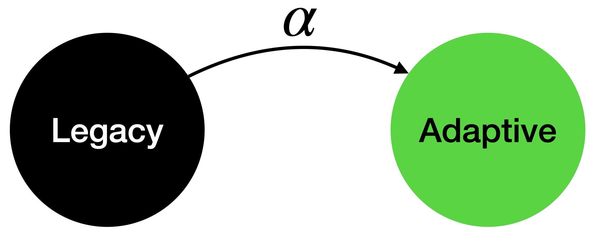

# Review: motivated by Ostrom's design principles for sustainable socio-economic systems

## Ostrom's design principles for sustainable socio-ecological systems

-   Elinor Ostrom led development of *social-ecological systems* theory,
    which identified *design principles* to sustainably manage
    *common-pool resources* like clean water or healthy forests; all the
    common-pool resources together are called the commons.
    -   First woman to win a Nobel prize in economics (2009)

::::: columns
::: {.column width="30%"}

:::

::: {.column width="70%"}
-   Select *design principles* (8 total; see @Cox2010 reading for an
    overview):

    -   Rules should fit local circumstances
    -   Participation of *all* stakeholders is vital
        -   Management of the commons must be organized across social
            and institutional scales
        -   All levels of social hierarchy must be recognized and free
            to organize
    -   Conflict resolution should be easily accessible
:::
:::::

## Ostrom's work elevated Indigenous adaptation

Traditional, Indigenous adaptations for a changing climate are often
outperform alternative technological innovations [@Piggott-McKellar2020;
@McNamara2020].

::::: columns
::: column
\]](../1-resources/WomenScientistsPacificIslands.jpg){fig-align="center"
height="400px"}
:::

::: column
\]](../1-resources/Yurok_Ceremonial_First_Light.jpg){fig-align="center"
height="400px"}
:::
:::::

## Computational social science for sustainability

-   The design principles were *inferred* from decades of studies by
    various authors
-   Computation based on mechanistic models can provide *deductive*
    predictions of how *social phenomena* emerge from social
    interactions
-   *Social phenomena* include
    -   The diffusion and innovation of adaptations
    -   Cooperation and coordination to sustainably manage common-pool
        resources
    -   Rising political extremism and polarization
    -   The meaning of words (not enough time in this quarter's EBS
        181/281)

## Plan for today

How useful practices propagate through populations

1.  Social learning, breifly
2.  The Legacy-Adaptive (LA) and Legacy-Adaptive-Legacy (LAL) models of
    diffusion via "contagion"
    -   Begin with deriving them with deterministic equations
    -   Then with stochastic, generative models
3.  Social networks structure social learning: who learns from whom

## Beyond today

1.  More network constructions: small-world and scale-free networks
2.  Success-biased social learning and other social learning strategies
3.  How certain social networks may boost both innovation and inequality
4.  Analysis of group structure and its effect on the diffusion of
    adaptations
5.  Cooperation and coordination
6.  Social influence and opinion dynamics: beliefs as particles

# Legacy-Adaptive (LA) and Legacy-Adaptive-Legacy (LAL) models

## Legacy-adaptive (LA) model

-   *Adapted* from the susceptible-infected (SI) model of disease
    transmission, i.e., a model of *contagion* where something spreads
    through contact with others.
    -   Assume that when an observer doing $L$ (legacy behavior)
        interacts with someone doing $A$ (adaptive behavior), there is a
        probability $\alpha$ that the observer starts doing $A$.
    -   $\alpha$ is the *adoption probability*

{fig-align="center" width="400"}

## Why this "legacy-adaptive" dichotomy?

::::: columns
::: {.column width="50%"}

:::

::: {.column width="50%"}
-   "The legacy media want to destroy your right to freedom of speech"
    [says Elon Musk](https://x.com/elonmusk/status/1854925239693832576)
-   Musk effectively repurposed the phrase "legacy software", which
    indicates old, outdated software that will one day be abandoned
-   It may be helpful to harness this phrase to the same effect as Musk
    does, but as a label for unsustainable behaviors
-   It can be important to contest certain concepts like "legacy" to
    restrain others from defining how useful terms can be used
:::
:::::

## The adaptation influencer case

-   Oftentimes people will eventually adopt a behavior if they observe
    an "influencer".
-   If we are designing a sustainability *intervention*, we may want to
    know how long it will take for everyone who is influenced by an
    influencer to adopt some behavior

## The influencer

Let's use one of my favorite sustainable behaviors, biking, to
illustrate this first model!

{width="600px"}

## The influencer

::::: columns

::: {.cell}

:::

::: {.column width="55%"}
Initialization: time step $t=0$; B: biker, N: not biker

::: {.cell}
::: {.cell-output-display}
{width=960}
:::
:::

:::

::: {.column width="45%"}
{fig-align="center"}

-   A *node* or *vertex* (circles) represents a person
-   An *edge* (arrows) represents a relationship between two people
-   Edge arrows indicate the direction of information flow
-   Only connected people interact
:::
:::::

## The influencer

::::: columns

::: {.cell}

:::

::: {.column width="55%"}
As time progresses ($t > 0$) more family members start biking.

::: {.cell}
::: {.cell-output-display}
{width=960}
:::
:::

:::

::: {.column width="45%"}
{fig-align="center"}
:::
:::::

## The influencer

::::: columns

::: {.cell}

:::

::: {.column width="55%"}
Time step $t = T$, the *fixation time* when all individuals share the
same behavior.

::: {.cell}
::: {.cell-output-display}
{width=960}
:::
:::

:::

::: {.column width="45%"}
{fig-align="center"}
:::
:::::

## Formal influencer model as LA model

::::: columns
::: {.column width="55%"}

::: {.cell}
::: {.cell-output-display}
{width=960}
:::
:::

{fig-align="center" width="200"}
:::

::: {.column width="45%"}
At each time step, $t$, a fraction $\alpha$ of the population of $N-A_t$
targeted individuals changes their behavior from $L$ to $A$.

Therefore, $$
A_{t+1} = A_t + \alpha (N - A_t)
$$
:::
:::::

## Deterministic influencer model as LA model

$$
A_{t+1} = A_t + \alpha (N - A_t),\quad N=100,~\alpha=0.05,~A_0=5
$$

::: {.cell layout-align="center"}
::: {.cell-output-display}
{fig-align='center' width=960}
:::
:::

## LA model in a "well-mixed" population

::::: columns
::: {.column width="60%"}

::: {.cell}
::: {.cell-output-display}
{width=960}
:::
:::

:::

::: {.column width="40%"}
-   "Well-mixed" means that all individuals can learn from every other
    individual
-   We also assume that $N\to\infty$ so that it makes more sense
    (maybe?) to have model output in terms of "fractional people"
-   If we were to draw the social network, every agent would have a line
    to every other agent indicating ubiquitous bi-directional influence
:::
:::::

## LA model in a "well-mixed" population

1.  Unlike the influencer model, individuals are only exposed to $A$ if
    a neighbor knows the behavior
2.  This also means that the rate of diffusion of $A$ is not constant

## LA model in a "well-mixed" population

::: nonincremental
1.  Unlike the influencer model, individuals are only exposed to $A$ if
    a neighbor knows the behavior
2.  This also means that the rate of diffusion of $A$ is not constant
:::

$$
A_{t+1} = A_t + \alpha A_t (1 - \frac{A_t}{N})
$$

# Legacy-adaptive-legacy (LAL) model

## Legacy-adaptive-legacy (LAL) model

-   Adapted from the susceptible-infected-susceptible epidemiology model
-   Identical to LA model, except that there is a *drop probability*
    $\delta$ that someone performing $A$ regresses to again perform $L$

{fig-align="center" width="368"}

## Legacy-adaptive-legacy (LAL) model

$$
A_{t+1} = A_t + \alpha A_t (1 - \frac{A_t}{N}) \text{ ...? }
$$

{fig-align="center" width="200"}

## Legacy-adaptive-legacy (LAL) model 

*Need to subtract the fraction of those doing* $A$ who regress to do $L$

$$
A_{t+1} = A_t + \alpha A_t (1 - \frac{A_t}{N}) - \delta A_t
$$

{fig-align="center" width="200"}

## Will an adaptation spread or go extinct?

Check $R_0$, the rate of change of $A_t$ when $A_t << N$

## What will be the equilibrium value of $A_t$?
\vspace{5em}
Set $A_\infty = A_{t+1} = A_t$

## References

